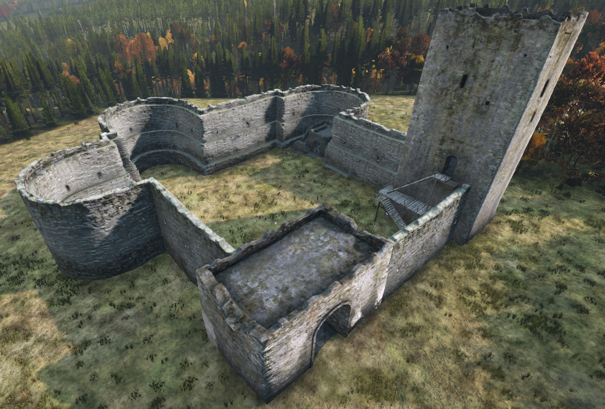

# Table of Contents

 - [Home](./README.md)
 - [/custom Folder Explained](./custom%20Folder%20Explained.md)
 - [Object Spawning](./Spawning%20Objects.md)

## Object Spawning
DayZ has released a new way to spawn objects and buildings in update 1.15.  
  
The first thing you'll need to do is `Enable cfgGameplay.json` in your Nitrado settings.
 - It should be a check box at the bottom of the **General** settings menu in the Nitrado dashboard.  
  
  
To use spawn objects correctly, you'll need to use the DayZ PC version and a tool to get the Y height variable.
 - I like to use [Community Offline Mode](https://github.com/Arkensor/DayZCommunityOfflineMode)

Once you've got your XYZ coordinates, you can also get the RPY (Roll, Pitch, Yaw) using the same editor, if you want to rotate your objects.
  
Here is a basic example on how to configure your JSON objects file.
```json
{
    "Objects": [
        {
            "name": "Land_Wall_Gate_FenR",
            "pos": [
                8406.501953125,
                107.73682403564453,
                12782.3388671875
            ],
            "ypr": [
                0.0,
                0.0,
                0.0
            ]
        },
        {
            "name": "Land_Wall_Gate_FenR",
            "pos": [
                8410.501953125,
                107.73682403564453,
                12782.3388671875
            ],
            "ypr": [
                0.0,
                0.0,
                0.0
            ]
        }
    ]
}
```
  
To avoid a reboot loop, keep these JSON files limited to **199 objects maximum**. You can make multiple JSON files if necessary.
  
Once you've built your objects file, save it to something similar to `objects_Map.JSON` and upload it to your `/custom` folder.  
**Object JSON files not placed in the `/custom` folder will be ignored.**  
  
Now you have your objects in the correct folder, lets add the file to your `objectSpawnersArr` in `cfgGameplay.json`  
Here's an example of what your `objectSpawnersArr` should look like.  
```json
"objectSpawnersArr": ["custom/objects_Map.json","custom/objects_Map1.json","custom/objects_Map2.json"]
```

## A Practical Example

**Now lets add this castle to Chernarus.**
