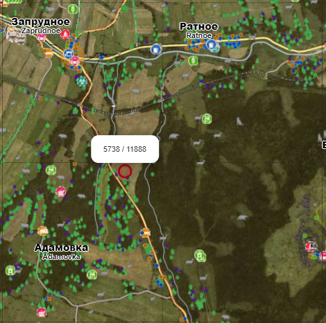

# Table of Contents

 - [Home](./README.md)
 - [/custom Folder Explained](./custom%20Folder%20Explained.md)
 - [Object Spawning](./Spawning%20Objects.md)

## Object Spawning
DayZ has released a new way to spawn objects and buildings in update 1.15.  
  
The first thing you'll need to do is `Enable cfgGameplay.json` in your Nitrado settings.
 - It should be a check box at the bottom of the **General** settings menu in the Nitrado dashboard.  
  
  
To use spawn objects correctly, you'll need to use the DayZ PC version and a tool to get the Y height variable.
 - I like to use [Community Offline Mode](https://github.com/Arkensor/DayZCommunityOfflineMode)

Once you've got your XYZ coordinates, you can also get the RPY (Roll, Pitch, Yaw) using the same editor, if you want to rotate your objects.
  
Here is a basic example on how to configure your json objects file.
```json
{
    "Objects": [
        {
            "name": "Land_Wall_Gate_FenR",
            "pos": [
                8406.501953125,
                107.73682403564453,
                12782.3388671875
            ],
            "ypr": [
                0.0,
                0.0,
                0.0
            ]
        },
        {
            "name": "Land_Wall_Gate_FenR",
            "pos": [
                8410.501953125,
                107.73682403564453,
                12782.3388671875
            ],
            "ypr": [
                0.0,
                0.0,
                0.0
            ]
        }
    ]
}
```
  
To avoid a reboot loop, keep these json files limited to **199 objects maximum**. You can make multiple json files if necessary.
  
Once you've built your objects file, save it to something similar to `objects_Map.json` and upload it to your `/custom` folder.  
**Object json files not placed in the `/custom` folder will be ignored.**  
  
Now you have your objects in the correct folder, lets add the file to your `objectSpawnersArr` in `cfgGameplay.json`  
Here's an example of what your `objectSpawnersArr` should look like.  
```json
"objectSpawnersArr": ["custom/objects_Map.json","custom/objects_Map1.json","custom/objects_Map2.json"]
```

## A Practical Example

**Now lets add this castle to Chernarus.**  
  

  
Open a new notepad and copy the following contents:  
```json
{
  "Objects": [
    {
      "name": "Land_Castle_Gate",
      "pos": [ 5710.3876953125, 221.85804748535156, 11882.9130859375 ],
      "ypr": [ 45, 0, 0 ]
    },
    {
      "name": "Land_Castle_Wall1_20",
      "pos": [ 5721.5791015625, 222, 11866.0546875 ],
      "ypr": [ -135, 0, 0 ]
    },
    {
      "name": "Land_Castle_Bergfrit",
      "pos": [ 5733.86083984375, 232.9653778076172, 11858.1982421875 ],
      "ypr": [ 45, 0, 0 ]
    },
    {
      "name": "Land_Castle_Wall1_20",
      "pos": [ 5747.521484375, 222, 11867.8935546875 ],
      "ypr": [ 135, 0, 0 ]
    },
    {
      "name": "Land_Castle_Bastion",
      "pos": [ 5767.47314453125, 222, 11876.9814453125 ],
      "ypr": [ 135, 0, 0 ]
    },
    {
      "name": "Land_Castle_Wall1_Corner1",
      "pos": [ 5768.61083984375, 221.89999389648438, 11889.9443359375 ],
      "ypr": [ 135, 0, 0 ]
    },
    {
      "name": "Land_Castle_Wall1_20",
      "pos": [ 5762.37158203125, 222, 11897.1337890625 ],
      "ypr": [ 45, 0, 0 ]
    },
    {
      "name": "Land_Castle_Bastion",
      "pos": [ 5753.404296875, 222, 11916.955078125 ],
      "ypr": [ 45, 0, 0 ]
    },
    {
      "name": "Land_Castle_Wall1_Corner1",
      "pos": [ 5740.57275390625, 221.90005493164062, 11917.9013671875 ],
      "ypr": [ 45, 0, 0 ]
    },
    {
      "name": "Land_Castle_Bastion",
      "pos": [ 5727.57275390625, 222, 11916.7216796875 ],
      "ypr": [ -45, 0, 0 ]
    },
    {
      "name": "Land_Castle_Wall1_20",
      "pos": [ 5718.72021484375, 222, 11897.021484375 ],
      "ypr": [ -45, 0, 0 ]
    },
    {
      "name": "Land_Castle_Stairs",
      "pos": [ 5734.23193359375, 223.1116943359375, 11868.3544921875 ],
      "ypr": [ 135, 0, 0 ]
    },
    {
      "name": "Land_Castle_Bastion2",
      "pos": [ 5765.560546875, 218.63156127929688, 11877.2939453125 ],
      "ypr": [ 135, 0, 0 ]
    },
    {
      "name": "Land_Misc_Well_Pump_Yellow",
      "pos": [ 5734.0830078125, 219.68341064453125, 11866.7041015625 ],
      "ypr": [ -135, 0, 0 ]
    },
    {
      "name": "Land_FuelStation_Feed_Enoch",
      "pos": [ 5735.92041015625, 219.705322265625, 11866.724609375 ],
      "ypr": [ 45, 0, 0 ]
    },
    {
      "name": "Land_Roadblock_WoodenCrate",
      "pos": [ 5727.76123046875, 229.4540252685547, 11860.919921875 ],
      "ypr": [ 45, 0, 0 ]
    },
    {
      "name": "Land_Roadblock_WoodenCrate",
      "pos": [ 5728.33740234375, 229.4540252685547, 11860.333984375 ],
      "ypr": [ 45, 0, 0 ]
    },
    {
      "name": "Land_Castle_Wall1_Corner1",
      "pos": [ 5703.92529296875, 220.26876831054688, 11884.0546875 ],
      "ypr": [ -179.99989318847656, 0, 0 ]
    },
    {
      "name": "Land_Wall_Gate_IndCnc4",
      "pos": [ 5705.5537109375, 226.79042053222656, 11882.1240234375 ],
      "ypr": [ 45, 0, 0 ]
    },
    {
      "name": "Land_Wall_Gate_IndCnc4",
      "pos": [ 5709.9287109375, 223.7920684814453, 11877.7685546875 ],
      "ypr": [ 45, 0, 179.99989318847656 ]
    },
    {
      "name": "Bonfire",
      "pos": [ 5738.83056640625, 220.05563354492188, 11888.716796875 ],
      "ypr": [ 45, 0, 0 ]
    }
  ]
}
```
  
Save this file as `objects_Castle.json`  
Upload the file to the `/dayz.Offline.chernarusplus/custom` folder on Nitrado.  
  
Now open up your `cfgGameplay.json` file and navigate to the `objectSpawnersArr` to include the new file.  
```json
"objectSpawnersArr": ["custom/objects_Castle.json"]
```
  
Save and upload your `cfgGameplay.json` to Nitrado, and reboot your server for changes to take place.  
Now if you did everything correctly, you should have a well lit castle, with a water well and gas pump inside, spawned at this location:

